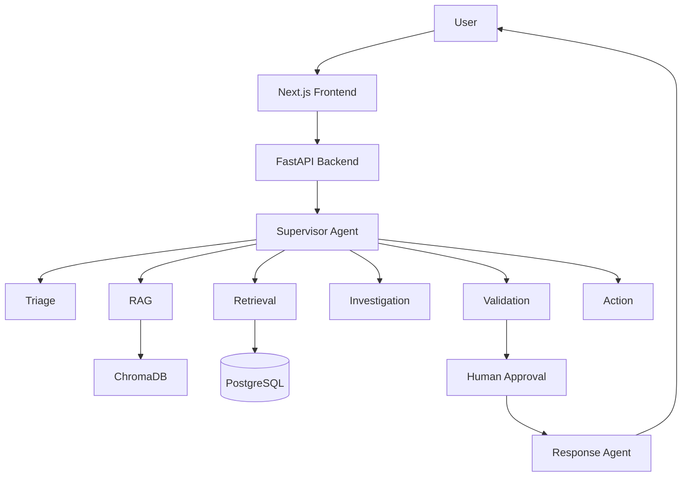

# Personalized Recommendation Explanation Agent

This project demonstrates a grounded, explainable recommendation system for retail scenarios using a multi-agent orchestration pattern, retrieval augmentation, and a FastAPI + Next.js stack.

## Overview

The system explains why a product recommendation was generated using verified customer constraints and product attributes while avoiding unsupported or sensitive logic leakage.

## Business problem

Retail shoppers and support agents need clear explanations of why a product was recommended, based on verified inventory, compatibility, preferences, and policy constraints.

## Features

- Triage and intent classification
- Data retrieval from mock customer and product APIs
- RAG knowledge retrieval with citations
- Investigation and evidence synthesis
- Human approval for consequential actions
- Validation and retry flow
- Local Docker setup
- Vercel-ready frontend

## Architecture



## Folder structure

```text
project-root/
├── backend/
│   ├── app/
│   │   ├── agents/
│   │   ├── config.py
│   │   ├── database.py
│   │   ├── graph/
│   │   ├── main.py
│   │   ├── models/
│   │   ├── rag/
│   │   ├── services/
│   │   ├── tools/
│   │   └── tests/
│   ├── data/
│   ├── Dockerfile
│   └── requirements.txt
├── frontend/
│   ├── app/
│   ├── package.json
│   └── next.config.js
├── .env.example
├── docker-compose.yml
├── requirements.txt
├── README.md
└── .gitignore
```

## Local setup

1. Copy `.env.example` to `.env`
2. Install backend dependencies
3. Start the app locally

```bash
cp .env.example .env
python -m venv .venv
source .venv/bin/activate
pip install -r requirements.txt
uvicorn backend.app.main:app --reload
```

For the frontend:

```bash
cd frontend
npm install
npm run dev
```

## Docker

```bash
docker compose up --build
```

## Environment variables

- OPENAI_API_KEY
- OPENAI_MODEL
- EMBEDDING_MODEL
- DATABASE_URL
- REDIS_URL
- CHROMA_URL
- CHROMA_COLLECTION_NAME
- CORS_ORIGINS

## Testing

```bash
pytest backend/tests/test_health.py
```

## Notes

This repository is a starter architecture and demo implementation. It is designed to be extended with real APIs, deeper rule validation, and production-grade security, storage, and telemetry.
